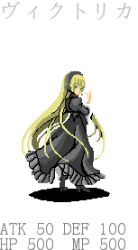

Anyway,it is not general for rvdata file but you can see some intuition.

### Usage

		In [74]: extract_f('Enemies.rvdata')[-44]

		In [75]: Out[74]: 
		{'HP': 500,
		 'MP': 500,
		 'atk': 50,
		 'battler': '141\xe3\x83\x93\xe3\x82\xaf\xe3\x83\x88\xe3\x83\xaa\xe3\x82\xab',
		 'def': 100,
		 'des': '<\xe6\x94\xbb\xe6\x92\x83\xe5\xb1\x9e\xe6\x80\xa7 2>\r\n<\xe7\x9b\x97\xe3\x82\x80 A:118 30%>\r\n<\xe7\x9b\x97\xe3\x82\x80 A:102 30%>\r\n<\xe5\x9b\xb3\xe9\x91\x91\xe8\xaa\xac\xe6\x98\x8e>\r\n\xe5\x87\xba\xe7\x8f\xbe\xe3\x82\xa8\xe3\x83\xaa\xe3\x82\xa2\r\n\xe3\x83\xbb\xe5\x9b\xb3\xe6\x9b\xb8\xe9\xa4\xa8\xe5\xa1\x94\r\n\xe4\xbd\xbf\xe7\x94\xa8\xe3\x82\xb9\xe3\x82\xad\xe3\x83\xab\r\n\xef\xbc\x9c\xe3\x83\xa2\xe3\x83\xb3\xe3\x82\xb9\xe3\x83\x88\xe3\x83\xab\xe3\x82\xb7\xe3\x83\xa3\xe3\x83\xab\xe3\x83\x9e\xe3\x83\xb3\xef\xbc\x9e\r\n\xe8\xad\xb7\xe8\xa1\x9b\xe3\x82\x92\xe5\x8f\xac\xe5\x96\x9a\xe3\x81\x99\xe3\x82\x8b\xe3\x80\x82\r\n\xef\xbc\x9c\xe7\x81\xb0\xe8\x89\xb2\xe7\x8b\xbc\xef\xbc\x9e\xe5\xaf\xbe\xe8\xb1\xa1[\xe5\x8d\x98\xe4\xbd\x93]\r\n\xe6\x95\xb5\xe5\x8d\x98\xe4\xbd\x93\xe3\x81\xab\xe9\x80\xa3\xe7\xb6\x9a\xe3\x81\x97\xe3\x81\xa6\xe3\x83\x80\xe3\x83\xa1\xe3\x83\xbc\xe3\x82\xb8\xe3\x82\x92\xe4\xb8\x8e\xe3\x81\x88\xe3\x82\x8b\xe3\x80\x82\r\n\xef\xbc\x9c\xe7\x9f\xa5\xe6\x81\xb5\xe3\x81\xae\xe6\xb3\x89\xef\xbc\x9e\xe5\xaf\xbe\xe8\xb1\xa1[\xe5\x91\xb3\xe6\x96\xb9\xe5\x85\xa8\xe4\xbd\x93]\r\n\xe5\x91\xb3\xe6\x96\xb9\xe5\x85\xa8\xe4\xbd\x93\xe3\x81\xae\xe7\x8a\xb6\xe6\x85\x8b\xe7\x95\xb0\xe5\xb8\xb8\xe5\x9b\x9e\xe5\xbe\xa9\xe3\x81\x95\xe3\x81\x9b\xe7\xb2\xbe\xe7\xa5\x9e\xe5\x8a\x9b\xe3\x82\x92\xe4\xb8\x8a\xe6\x98\x87\xe3\x81\x95\xe3\x81\x9b\xe3\x82\x8b\xe3\x80\x82\r\n </\xe5\x9b\xb3\xe9\x91\x91\xe8\xaa\xac\xe6\x98\x8e> ',
		 'dex': 75,
		 'exp': 2850,
		 'id': 141,
		 'name': '\xe3\x83\xb4\xe3\x82\xa3\xe3\x82\xaf\xe3\x83\x88\xe3\x83\xaa\xe3\x82\xab',
		 'spirt': 180}
 
I also write function output card like image to support my anther game.

		In [73]: cf.get_card(cf.enemies[-44])

